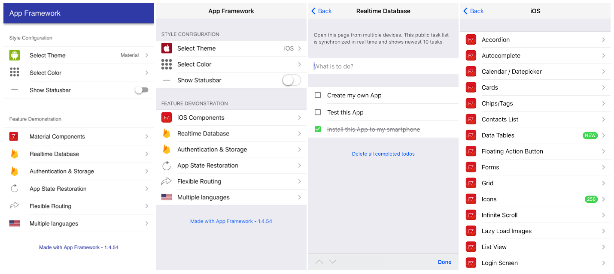

# App Framework 2

**iOS and Android Apps with HTML & JavaScript. App Framework combines great pieces of open source code to support your whole workflow with useful scripts and your App with powerful plugins. With App Framework, you can spend your time for your next amazing App and not for the tricky stuff around - free and open source!**

## Features

**Core**

- [x] **Beautiful User Interface** with native iOS and Material Design elements and transitions, based on [Framework7](https://framework7.io/)
- [ ] **Comprehensive Icon Fonts** like [FontAwesome](http://fontawesome.io/), [Framework7 Icons](http://framework7.io/icons/), [Ion](http://ionicons.com/) and [Material Design Icons](https://material.io/icons/) out of the box
- [ ] **Flexible Routing** for pages, tabs, modals and panels with dynamic routing support, realized with [Framework7-Vue](https://framework7.io/vue/navigation-router.html)
- [ ] **Multi-language Support** with language files and automatic completeness checks according the default language
- [x] **One Code Base** for all devices with HTML, CSS and JavaScript, realized with [Capacitor](https://capacitor.ionicframework.com/), supporting [ES2015](https://babeljs.io/learn-es2015/)
- [x] **Single File Components** for powerful but easy to maintain apps, made with [Vue.js](https://vuejs.org/) and [Framework7-Vue](http://framework7.io/vue/)
- [x] **Project Folder Creation**, lightweight and well-organized, ready to publish on [GitHub](https://github.com/about)

**Scripts**

- [x] **Live Development Server** with hot module replacement, powered by [Parcel](https://parceljs.org/)
- [x] **Test on your own Device** or in any iOS or Android emulator, supported by [Capacitor](https://capacitor.ionicframework.com/), [Xcode](https://developer.apple.com/xcode/) and [Android Studio](https://developer.android.com/studio)
- [x] **Test Framework** for code correctness and standard conformity with [ESLint](http://eslint.org/) and for unit tests with [Jest](https://facebook.github.io/jest/)
- [x] **Optimized Build Process** for good scores at [Google Lighthouse](https://developers.google.com/web/tools/lighthouse/), realized with [Parcel](https://parceljs.org/)
- [ ] **Icon Generation** for favicons, touch icons and splash screens, out of a single image file with [Jimp](https://github.com/oliver-moran/jimp)
- [x] **Easy Deployment** without downtime to [Apple App Store](https://developer.apple.com/xcode/), [Google Play Store](https://developer.android.com/studio), [Firebase Hosting](https://firebase.google.com/products/hosting/) or any FTP server

**Plugins**

- [x] **Native Hardware API Plugins** for iOS and Android devices, realized with [Capacitor](https://capacitor.ionicframework.com/)
- [ ] **Phone Frame** around your application on big screens, so you can offer desktop access with charm
- [ ] **State Restoration** for the history per view, tabs, scroll positions, focus, panels, modals and form inputs
- [ ] **Global Data Object** to save user data across several application restarts easily
- [ ] **Vuex Integration** to use the official Vue.js [state management library](https://vuex.vuejs.org/en/intro.html)
- [x] **Offline Capability** to use the app even without any network connection
- [ ] **Preloading** for images, fonts and JavaScript files
- [ ] **Firebase Integration** for several services like [Authentication](https://firebase.google.com/products/auth/), [Realtime Database](https://firebase.google.com/products/realtime-database/), [Firestore](https://firebase.google.com/products/firestore/) and [Cloud Storage](https://firebase.google.com/products/storage/)

## Demo App

&nbsp;&nbsp;&nbsp;

&nbsp;&nbsp;&nbsp;

## Documentation

**Quick Start** for the hurried

1. Run `mkdir my-app` to create a new project folder
2. Run `cd my-app` to open the project folder
3. Run `npm install app-framework` for installation
4. Run `npx app dev` to start the local development server

**Tutorial** for the beginners

- Setup: Node JS - Atom Code Editor - GitHub Repository - App Framework
- Development: Design - Views - Logic - Data Management - Firebase Integration - Hardware APIs
- Testing: Development Server - iOS Emulator - Android Emulator - Code Check - Unit Tests
- Deployment: Build - FTP Server - Firebase Hosting - Apple App Store - Android Play Store

**Reference** for the experts

- CLI Commands
- Configuration Options

**Guidelines** for the contributors

- Architecture
- Workflow
